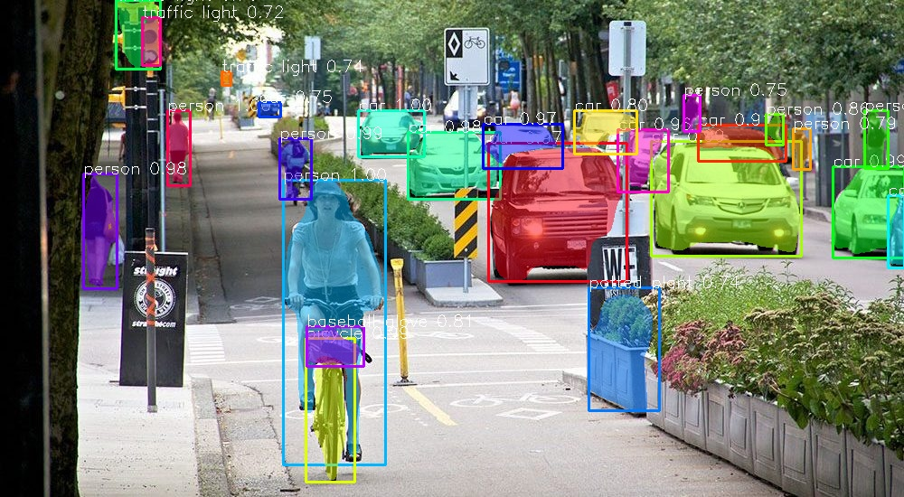

# Image-Segmentation-Using-Pixellib

### Pixellib is a library for performing segmentation of objects in images and videos. It supports the two major types of image segmentation 

### 1. Semantic segmentation

### 2. Instance segmentation 

## PixelLib supports two deep learning libraries for image segmentation which are Pytorch and Tensorflow 

### PixelLib Tensorflow Version 

### PixelLib supports tensorflow's version (2.0 - 2.4.1). Install tensorflow using 

### pip3 install tensorflow 

### If you have have a pc enabled GPU, Install tensorflow--gpu's version that is compatible with the cuda installed on your pc 

#### pip3 install tensorflow--gpu 

### Install Pixellib with 

#### pip3 install pixellib --upgrade 
 

 

